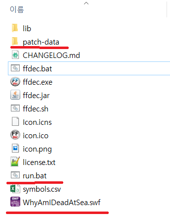
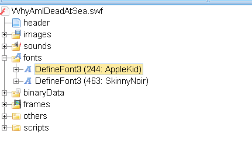
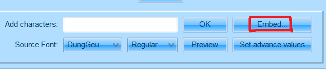
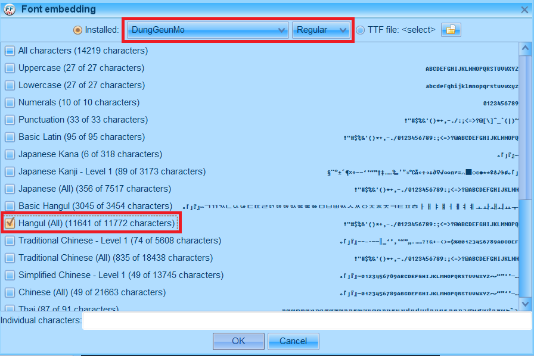
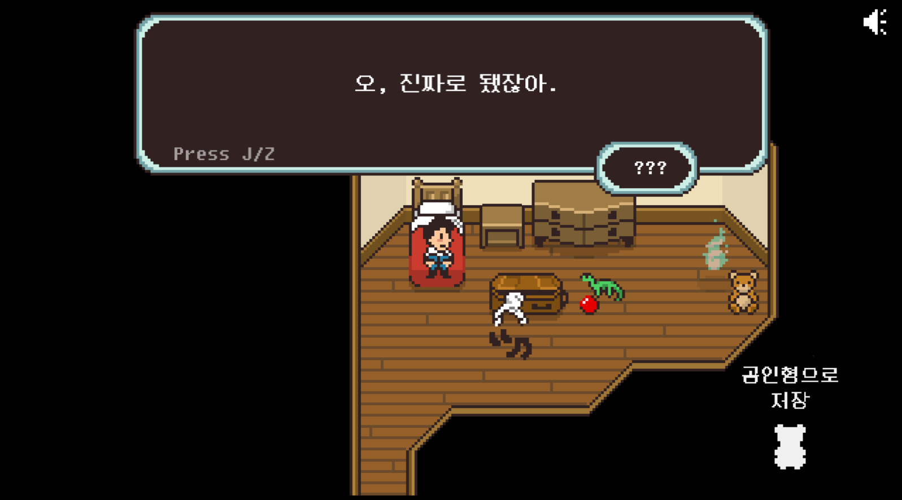

# Why Am I Dead At Sea 한국어 패치

## 현재 게임 업데이트로 인해 제대로 동작하지 않습니다. (2018/07/12)

---

## INSTALL

### 준비물

- JPEXS Free Flash Decompiler(<a href="https://www.free-decompiler.com/flash/download/">다운로드 링크</a>)

- 패치 파일 (Clone or Download -> Download Zip)

### 설치

##### 1. Why Am I Dead At Sea 게임 swf 파일 (WhyAmIDeadAtSea.swf)을 찾는다.

- 스팀 기준, 속성-로컬 파일-로컬 컨텐츠 폴더 보기

##### 2. 찾은 swf 파일을, JPEX Free Flash Decompiler를 다운로드 받은 폴더에 옮긴다.
- ffdec.bat파일과 swf파일이 같은 폴더에 위치하도록 한다.

##### 3. 패치 파일에서, patch-data 폴더와 run.bat 파일도 JPEX Free Flash Decompiler를 다운로드 받은 폴더에 옮긴다.

##### 4. run.bat을 실행한다.

##### 5. ffdec.exe를 실행하여 JPEX Free Flash Decompiler를 키고, WhyAmIDeadAtSea.swf를 연다.

##### 6. fonts폴더에서 AppleKid 폰트를 선택한다.

##### 7. Source Font에서 한글이 지원되는 폰트를 고르고, Embed...버튼을 눌러 `Hangul`을 추가시키고 저장(중요!) 후 종료한다. ([추천폰트](./font/244_DungGeunMo.ttf))

##### 8. swf 파일을 다시 원래의 게임 폴더로 옮긴다.

##### 9. Why am I Dead at Sea를 즐긴다.

---

### 번역 제안

마음에 들지 않는 번역, 오역, 오타 등이 있으면 자유롭게 `Issues` 또는 def6488@gmail.com으로 제시해주세요.

---

### FAQ

Q. 선택지가 나타나지 않는 버그가 발생했어요.

> A. 잠깐 swf 파일을 패치하기 전 원본 파일과 교체한 뒤, 문제가 발생하는 부분을 진행한 후에 다시 패치된 swf 파일로 바꿔주세요.
> 덤으로 해당 이슈를 제보해주시면 좋습니다 :)

Q. 캐릭터 이름은 왜 번역을 안 했나요?

> A. 이름과 관계된 스토리가 있는데 한글로는 그것을 잘 표현하기가 어려워서 원어를 사용했습니다.
> 플레이 하기에 불편하다고 느껴지면 상황을 봐서 한글로 바꾸려고 합니다

---

### 샘플 스크린샷

